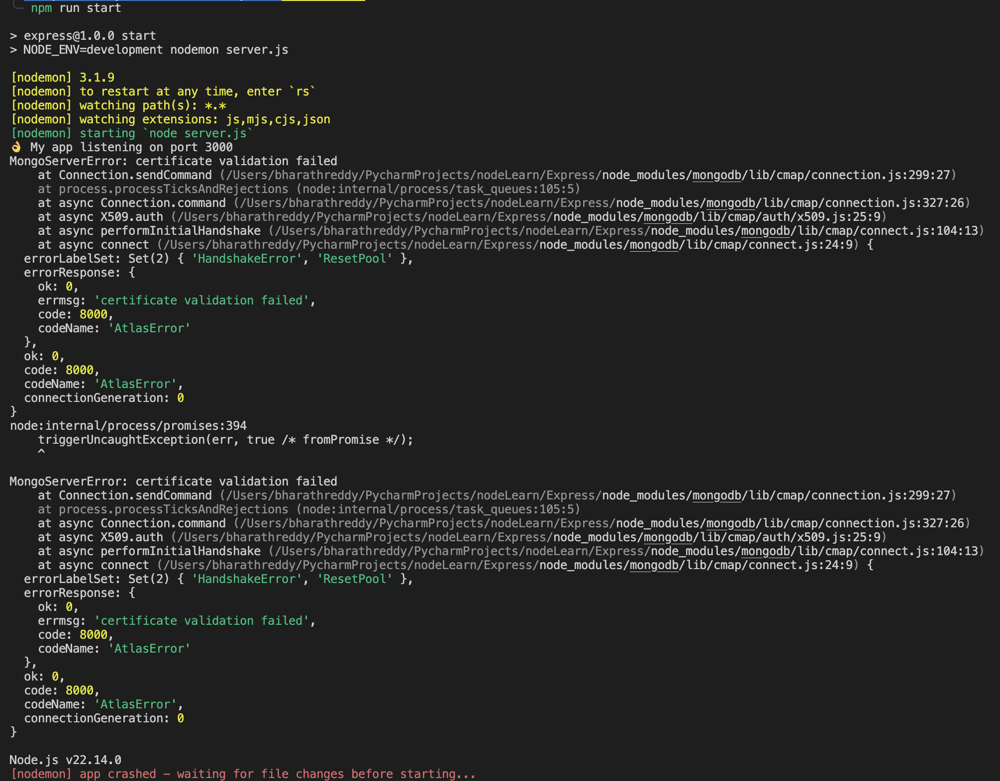

# Express App with MVC Architecture


# 🧪 CHANGE LOG (from commit `e23133e` onwards)

> (Generated using a simple AI tool from git commit messages.)

---

## 1. Commit `945c62e`: Basic Express app with routes setup

- Mongoose Model added.
- Routes setup.
- Morgan middleware setup.

---

## 2.🥉 MVC Architecture Setup

### 2.1 Commit `22ac775`: Routers setup

- Moved tour routes into a separate file: `tourRouter.js`.
- Route handlers moved to `tourRouter.js`.
- Required mongoose model and schema setup moved as well.

### 2.2 Commit `ec19e6b`: Controller setup

- Split out route handler functions into `tourController.js`.
- Controller functions need `Tour` object so spit out all of mongoose code from tourRouter.js to tourController.js

### 2.3 Commit `6fdedfb`: Model setup

- Split out all mongoose code i.e. schema and model and Tour model intantiation to `tourModel.js`.
- Controller imports `Tour` model.

### 2.4 Commit `500c4d5`: Data import and delete scripts

- Added a helper script `import-data.js` to run independently to import data from json and to delete all data from mongo. Here is how to use it.:
  ```bash
  node ./dev-data/data/import-data.js --delete
  node ./dev-data/data/import-data.js --import
  ```
- The code parses the `process.argv[2]`, the 0 arg is node , 1st is ./dev-data/data/import-data.js, we capture second after this to execute relavent function.

---

## 3. Server and App separated

---

## 4. 🗃️ Advanced Query Filtering

### 4.1 Capturing `req.query` from API `/api/v1/tours?difficulty=easy&duration=5`

- Mongoexpected query format simple filter `{difficulty:"easy", duration: 5}`. Here req.query capures exactly the same if API query is `/api/v1/tours?difficulty=easy&duration=5`. However first we need to seperate out some special params out of the request body.

- Special params like `page`, `sort`, `limit`, `fields` separated.

### 4.2 Commit `4bb6aa1`: Filter out special parameters

- as these mean some special things. Now request like `/api/v1/tours?difficulty=easy&duration=5&limit=5` would be handled properly by removing `limit=5`from requrest query.

### 4.3 Commit `f000276`: Advanced filtering with operators

- Support for `gte`, `gt`, `lte`, `lt`.
- Example:
  ```bash
  /api/v1/tours?difficulty=easy&duration[gte]=5
  ```
- Used the `qs` library to parse deeply nested queries.
- `app.set("query parser", (str) => qs.parse(str));`
- Advance filtering to allow operators like `>=` , `>`, `<=`, and `>`. Mongoose query would look like `{difficulty:"easy", duration: {$gte: 5}}` and api looks like `/api/v1/tours?difficulty=easy&duration[gte]=5`. For this conversion we need to use a library called `qs` on npm see the documentation to see it converts query strings to deeply nested objects. we need to do `app.set("query parser", (str) => qs.parse(str));` while app.get _mounts_ a middleware, app.set is used to configure Express settings. Here we are setting express' req.query parser to qs which then converts the req.query objects to deeply nested objects.

### 4.4 Commit `4ca1d11`: Sorting

- remove await from `let tours = await Tour.find(mongoQuery);`. Await causes tours to be immediately populated by an array of documents. but without Await the result of any .find is a `query` object. These objects are chainable. For sort we need to chain the .find result with .sort. Hence we need to build a query first and then execute the query.
- Then check if req.query has sort field and if yes chain the query with sort method with sort parameter, before calling the entire chain.
- For descending order use `/api/v1/tours?difficulty=easy&duration[gte]=5&sort=-price`. Notice the `-` in front of sort field.
- Sorting ties use this `api/v1/tours?sort=duration,-price` so we need to replace `,` by a `space`.
- API:
  ```bash
  /api/v1/tours?sort=duration,-price
  ```

### 4.5 Commit `ed50193`: Projection (Limiting Fields)

- API:
  ```bash
  /api/v1/tours?fields=name,difficulty,price,summary
  ```

### 4.6 Commit `7fa58dd`: Pagination

- API:
  ```bash
  /api/v1/tours?page=2&limit=4
  ```

### 4.7 Commit `9b0860d`: Aliasing

- Lets say we want to expose a simple easy to remember endpoint for top 5 cheapest tours ranked by rating. for this
- First add a route to tourRouter.js
- Create a middleware to Prefill all the query fields and use this middleware in the router to hit the controller getAllTours.
- `/top-5-cheap` preset API with prefilled query fields.

### 4.8 Commit `6601f03`: Aggregates

- Create a new route.
- Add MongoDB aggregation operation.

### 4.9 Commit `90cf327`: Refactor

- Moved all sorting, filtering, pagination etc. into a utility class in `utils/apiFeatures.js`.
- Note: This refactor happened **after** commit `5795fd1`.

---

## 5. 🦔 Commit `eac90c2`: Mongoose Middleware

> you must add all middleware and plugins `before` calling mongoose.model(). Calling pre() or post() after compiling a model does not work in Mongoose.

### 📄 5.1 Document Middleware (pre-save)

- a pre-hook document middleware added, uses slugify package, creates a slug and adds it to the document on every save (`create()` fires `save()` hooks.). This requires we add the `slug` property to the schema.
- `Post` middleware are executed after the hooked method and all of its pre middleware have completed.
- `this` keyword points to the document in pre-save middleware.
- Middleware automates:
  - Complex validation
  - Cleaning up dependent documents
  - Async defaults/tasks

### ❓ 5.2 Query Middleware

- `this` keyword points to the current Query object.
- Added pre-find hook to filter out secret tours.
- NOTE: current implementation runs before any `find` but doesnt run on `findOne` or any other type of find. To make the middleware work on all of these simply replace `find` with a regular expression for all words starting with find : `/^find/`.

###🧺 5.3 Aggregation Middleware

- `This` keyword in all query middleware points the current `Aggregation object`.
- `this.pipeline()` used to manipulate aggregation stages.
- Added a `$match` stage to filter secret tours.

---

## 6.👍 Commit `9842d31`: Validators

- Move as much business logic to the Model layer.
- Used `validator` library for custom validations.

---

## 7.🔥 Error Handling

### 7.1 Debugging with `ndb`

- Install globally:
  ```bash
  npm i ndb --global
  ```
- In `package.json` scripts:
  ```json
  "debug": "ndb server.js"
  ```
- Run:
  ```bash
  npm run debug
  ```

### 7.2 Commit `625666f`: Handling unhandled routes

- Added middleware at the end of `app.js`.
- If none of the routes match, respond with a 404 JSON.
- before this unhandled routes looked like this
  
- Adding a middleware at the end of app.js. This middleware is reached only if none of above middlewares are hit. There is at least 1 middleware where responce is sent back terminating the req-res cycle. So if this middleware his hit that means - it must have been a route which is not handled.

### 7.3 Global Error Handling

- add a global error handler middleware. This takes 4 params, if we put 4 params on any middleware - express will detect it as global error middleware.
- change wrongroute middleware to generate and error.

#### 7.3.1 Commit `4e03cff`

- Pass errors to next middleware using `next(err)`.
- If anything is passed into next in any middleware, express will assume its an error and will bypass rest of middlware stack and pass this error to the global error handler.

#### 7.3.2 Commit `1b60399` Refactor

- Create reusable `AppError` class in `utils/appError.js`.
- Captures stack trace properly.

#### 7.3.3 Commit `5795fd1` Refactor

- Moved global error handler into `controllers/errorController.js`.

#### 7.3.4 Commit `db46d36` Handling Errors in Async Functions

- Controllers now use `try...catch`.
- Forward errors using `next(err)` to the global error middleware.
- this is the current controller

  ```js
  exports.getTour = async (req, res, next) => {
    try {
      const tour = await Tour.findById(req.params.id);
      res.status(200).json({
        status: "Success",
        data: tour,
      });
    } catch (err) {
      err.statusCode = 404;
      err.status = "fail";
      err.isOperational = true;
      next(err);
    }
  };
  ```

- we wrap this inside `catchAsynch` function which returns an anonymous function which will be assigned to each controller _(ex: addTour, getAllTours etc.)_
- This anonymous function runs the main function and returns a promice and hence we can chain it with `.catch()` and this allows us to get rid of catch block in each controller.
- Use AppError Util to generage & return custom error message, this will pass the right error status and error message to the error controller.

#### 7.3.4 Commit `814d5fb` Prod and Dev errors separated, Uncaught exceptions and Unhandled rejections.

- In error controller split out separate functions for dev and prod errors, have different start scripts for dev and prod.
- Split out operational and programming errors.
- Mongoose generates errors where i am not managing the error, so these are **NOT** marked with `err.isOperational` tag. Checking these error messages they are broadly three types. Handle them in the function split above.
- Broad 3 types of mongoose errors are all handled now.
- Errors - `Unhandled rejections` : we can test it by changing mongo key to mimic mongo down. This leads to app crashing
  
- For these type of errors can make the state of node inconsistent and hence we should shutdown the application. So we crash the app after logging.
- Uncaught Exceptions - bugs in code or synchronous functions. I use `process.on('uncaughtException', errorcallback)`

## 8. 🕵 AuthN and AuthZ

### 8.1 Setting up users

- **d24bb8c** Signup endpoint created
- use `bcryptjs` to salt & hash passwords, this is used in pre-save hook on usermodel. We want the password to first match passwordConfirm done by model validation, then trigger a pre-save middleware to salt and hash the password, replace the password with hash and set the passwordConfirm to undefined.

---

# ✅ My Notes

- Notes to myself: come back to this later
